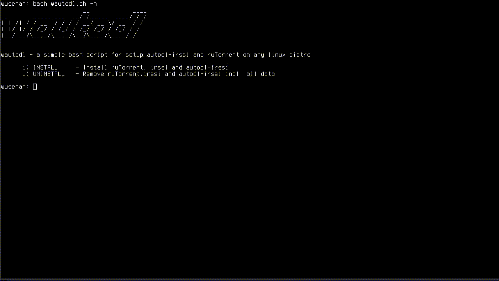

# WAUTODL

# README

wautodl is a script that will install ruTorrent, autodl, irssi and also configure everything for you, autodl-irssi is a plugin for 
irssi that monitors IRC announce channels for torrent trackers and downloads torrent files based on user-defined filters.

You will have your setup ready in ~10 seconds.

# HOWTO

** DONT RUN THIS SCRIPT AS ROOT **

    git clone https://github.com/wuseman/WAUTODL
    cd WAUTODL; chmod +x wautodl; bash wautodl.sh 

# REQUIREMENTS

A linux setup would be good ;)

# CONTACT

If you have problems, questions, ideas or suggestions please contact us by posting to wuseman@nr1.nu

# WEB SITE

Visit our homepage for the latest info and updated tools

https://github.com/wuseman && https://nr1.nu

# END!
